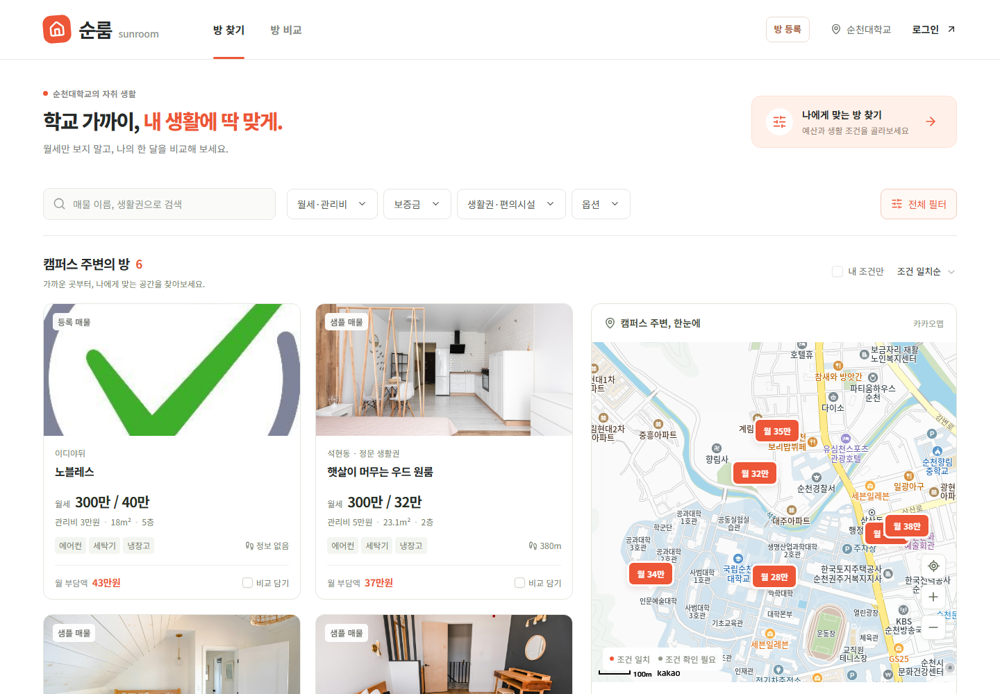

# 순룸 Sunroom

> **순천대 학생이 월세만이 아니라 '한 달 비용'과 통학 거리로 원룸을 비교하고, AI가 확인된 정보만으로 두 방의 차이를 설명해 주는 서비스**

🔗 **서비스 주소: https://a7.scnuoss.net**
SCNU OSS · AI 해커톤 (고급 교육) · 팀 a7



## 왜 만들었나

- 학교 앞 원룸은 부동산 앱보다 **집주인 개인 게시판·전단**으로 나와서 한곳에서 보기 어렵다
- 월세만 보고 고르면 **관리비·보증금까지 합친 실제 부담**을 놓친다
- 방 두 개를 두고 고민할 때 **조건을 나란히 비교**해 줄 곳이 없다

순룸은 **소유 인증을 받은 집주인**이 직접 올린 순천대 인근 매물을 예산·생활 조건으로 걸러 보고, 두 방을 비교하고, AI 설명을 받을 수 있게 한다.

## 주요 기능

| 사용자 | 기능 |
| ---  | --- |
| 🎓 학생  | 예산(월세·관리비·보증금)·옵션·편의시설 필터, **카카오 지도**에서 위치 확인, **월 부담액(월세+관리비)** 표시 |
| 🎓 학생  | 두 방 나란히 비교 + **AI 비교 추천** (원하는 생활을 문장으로 입력) |
| 🎓 학생  | 등록 매물 **채팅 문의**, 방문 시간 제안·수락, 신고·차단 |
| 🏠 집주인  | **소유 인증 신청** (등기사항증명서) → 관리자 승인 후 매물 등록 |
| 🏠 집주인  | 매물 등록·수정·공개 관리, 사진, 지도에서 위치 선택, **AI 매물 소개글 초안** (기존 게시글 붙여넣기 → 금액 자동 제안) |
| 🛡️ 관리자  | 인증 서류 심사 (승인·보완 요청·반려·권한 철회) `/admin` |
| 공통  | 이메일·카카오·구글 로그인, 모바일 화면 |

### AI가 없는 사실을 만들지 않게

| AI 기능 | 안전장치 |
| --- | --- |
| **비교 추천** | 매물 정보는 브라우저가 보낸 값이 아니라 **서버가 DB에서 다시 읽어** Gemini에 전달. 답변의 숫자를 **단위별로 DB 값·두 방의 차이와 대조**하고, 확인 안 된 옵션을 단정하거나 도보 시간처럼 없는 데이터를 말하면 거절 → 규칙 기반 요약으로 대체 |
| **소개글 초안** | 게시글의 전화번호·카톡 아이디는 **AI에 보내기 전에 가림**. 입력에 없는 채광·방음·거리·면적 등 추정 표현이나 연락처가 나오면 거절. 금액 제안은 게시글에 실제로 적힌 값만 |
| 공통 | AI 키 없음·혼잡·시간 초과·한도 초과에도 **서비스는 항상 동작** (규칙 기반 결과 + 이유 표시) |

## 대회 필수 항목 대응

| 항목   | 요구사항 | 순룸에서 한 것 |
| --- | --- | --- |
| **설계**   | 요구사항, 기술구성, 역할분담 | [docs/DESIGN.md](docs/DESIGN.md): 문제 정의, 기능·비기능 요구사항 12개, 기술 구성도, AI 설계, 역할 분담. API 계약 문서([API_CONTRACT](docs/API_CONTRACT.md) 등)와 zod 스키마로 프론트·백 형식 고정 |
| **AI 기능**   | AI 모델·API 데이터 활용 핵심 기능 | Google **Gemini**(`gemini-3.8-flash`, 예비 `gemini-3.5-flash`)로 **비교 추천**과 **매물 소개글 초안**. DB 근거 검증, 연락처 마스킹, 실패 시 규칙 기반 대체. 카카오 지도 API 연동 |
| **협업**   | 브랜치, Issue, PR | 파트별 브랜치(`fe`·`be`·`ai`·`feat/*`) → **PR 12개 병합**, **Issue 13개**(완료 기록·남은 작업, 라벨·담당 표시), PR ↔ Issue 연결(`Closes #16`) |
| **서버 배포**   | app.scnuoss.net 외부 접속 | **https://a7.scnuoss.net** 운영. nginx(정적 화면) + FastAPI(`/api`) 구조, `bash scripts/deploy.sh` 한 번으로 빌드·전송·실행·점검. [docs/DEPLOY.md](docs/DEPLOY.md) |
| **안정성**   | 오류·예외처리, 재시작 후 구동, 테스트 | Supervisor **자동 재시작**(강제 종료 후 복구 확인), `@reboot` cron. 모든 화면 로딩·빈 상태·오류 처리, 외부 API 실패 시 대체 동작. **테스트: 백엔드 282개, 프론트 23개**, GitHub Actions(타입 검사·테스트·빌드) |
| **문서화**   | README, 설치·배포 방법, 라이선스 출처 | 이 README, [개발 가이드](docs/DEVELOPMENT.md)(설치·실행·브랜치 규칙), [배포](docs/DEPLOY.md), [백엔드](backend/README.md), [MIT LICENSE](LICENSE), 라이브러리·API·사진 출처([THIRD_PARTY](docs/THIRD_PARTY.md), [DATA_SOURCES](docs/DATA_SOURCES.md)) |
| **보안**   | 비밀키·개인정보 비노출, 기본 보안 | 키는 서버 `.env`(권한 600)에만, 배포 시 비밀 파일 **외부 노출 자동 점검**. HttpOnly 세션 쿠키 + CSRF + Origin 검사, scrypt 비밀번호, 요청 빈도 제한. **집주인 권한은 화면이 아닌 서버에서 검사**, 공개 응답에 연락처 제외, 인증 서류 비공개 보관·파일 검사(형식 위장·PDF 스크립트 거절, 이미지 메타데이터 제거) |
| **최종 제출**   | 실행 URL, GitHub, 발표·시연 자료 | 실행 URL https://a7.scnuoss.net · GitHub 이 저장소 · 발표·시연 자료

## 기술 구성

```text
                         https://a7.scnuoss.net (nginx)
                ┌──────────────────┴──────────────────┐
      정적 화면 (Next.js → 정적 빌드)            /api/* → FastAPI (Supervisor)
      React 19 · Tailwind · shadcn/ui            ├ 세션 인증 · 카카오/구글 OAuth
      Kakao Maps JS SDK                          ├ 매물 · 채팅 · 집주인 인증 · 관리자 심사
              │                                  ├ Google Gemini (추천 · 소개글 초안)
              └──────── fetch /api/v1 ───────────┤   └ 근거 검증 → 실패 시 규칙 기반
                                                 └ Supabase PostgreSQL · Storage
```

| 영역 | 기술 |
| --- | --- |
| 프론트엔드 | Next.js 16 (vinext / Vite 8), React 19, TypeScript, Tailwind CSS 4, shadcn/ui, zod |
| 백엔드 | Python 3.12, FastAPI, Pydantic, SQLAlchemy, uvicorn |
| DB · 저장소 | Supabase PostgreSQL, Supabase Storage |
| AI · 외부 API | Google Gemini API, Kakao Maps / 카카오 로그인, Google OAuth |
| 배포 · 운영 | nginx, Supervisor, cron, GitHub Actions |

## 팀 · 역할

| 이름 | 역할 |
| --- | --- |
| 이태호 | 프론트엔드 |
| 김성규 | 백엔드 · 서버 배포 |
| 전인철 | 백엔드 · AI |
| 박진효 | 백엔드 · AI |

상세 담당은 [docs/DESIGN.md](docs/DESIGN.md#4-역할-분담).

## 실행해 보기

**배포 사이트:** https://a7.scnuoss.net — 학생으로 가입해 방 찾기·비교·AI 추천·채팅, 집주인으로 가입해 인증 신청을 해 볼 수 있음

**로컬 (백엔드 없이 시연 모드):** Node.js 22.13+, pnpm 11

```bash
pnpm install --frozen-lockfile
pnpm dev
```

http://localhost:5173 → 로그인 화면의 **사용자로 체험 / 집주인으로 체험**으로 역할별 흐름을 시연. 시연 모드에서는 '사용자로 체험' 계정이 `/admin` 관리자 역할.

**로컬 (백엔드 연결):** [backend/README.md](backend/README.md) 로 FastAPI 를 띄우고 `.env.local` 에 `NEXT_PUBLIC_DATA_MODE=http` 설정. 자세한 설치·환경변수·브랜치 규칙은 [개발 가이드](docs/DEVELOPMENT.md).

## 폴더 구조

```text
app/                 페이지 주소 (/, /compare, /chats, /landlord, /admin …)
src/features/        화면 (explore, compare, chat, landlord, admin, auth, maps …)
src/contracts/       프론트·백 데이터 계약 (zod)
src/services/        API 연결 (gateway.ts) · 시연용 mock
backend/app/         FastAPI (routers, AI: gemini·recommend·draft, 인증: verification)
backend/sql/         DB 마이그레이션 001~005
backend/tests/       pytest 282개
deploy/, scripts/    대회 서버 운영 설정 · 배포 스크립트
docs/                설계 · API 계약 · 배포 · 개발 가이드 · 라이선스 출처
```

## 문서

| 문서 | 내용 |
| --- | --- |
| [docs/DESIGN.md](docs/DESIGN.md) | 요구사항 · 기술 구성 · AI 설계 · 역할 분담 |
| [docs/DEVELOPMENT.md](docs/DEVELOPMENT.md) | 개발 규칙(AI 작업 시 입력) · 환경 구축 · 브랜치 · 커밋 규칙 |
| [docs/DEPLOY.md](docs/DEPLOY.md) | 대회 서버 배포 · 운영 |
| [backend/README.md](backend/README.md) | 백엔드 실행 · API 목록 · 인증 · AI |
| [docs/API_CONTRACT.md](docs/API_CONTRACT.md) · [LANDLORD](docs/LANDLORD_HANDOFF.md) · [CHAT](docs/CHAT_HANDOFF.md) · [OWNER_VERIFICATION](docs/OWNER_VERIFICATION_HANDOFF.md) | 프론트·백 연동 계약 |
| [docs/THIRD_PARTY.md](docs/THIRD_PARTY.md) · [docs/DATA_SOURCES.md](docs/DATA_SOURCES.md) | 오픈소스 · 외부 API · 사진 출처 |

## 한계와 다음 단계

샘플 매물 6개 + 직접 등록 매물로 운영 중이며 실제 매물 확보가 필요함. 도보 거리는 샘플 값, 집주인 인증은 계정 단위(건물 단위 연결 예정), AI 서류 심사 보조·찜 목록은 진행 예정. 남은 작업은 [Issues](https://github.com/20214260/one_room_map/issues) 참고.

## 라이선스

순룸 코드는 [MIT License](LICENSE). 사용한 라이브러리·외부 API·샘플 사진의 라이선스와 출처는 [docs/THIRD_PARTY.md](docs/THIRD_PARTY.md), [docs/DATA_SOURCES.md](docs/DATA_SOURCES.md).
